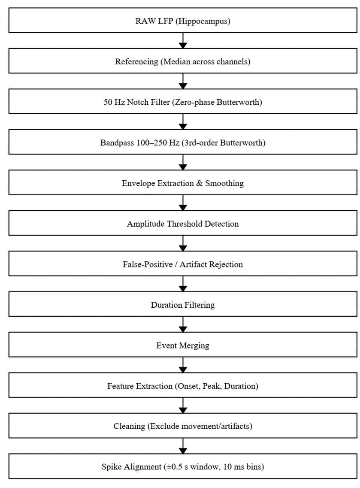

# Ripple Detection and Analysis Pipeline

Sharp-wave ripples (SWRs) were detected from hippocampal local field potential (LFP) recordings using a multi-stage signal processing pipeline implemented in MATLAB (RIPPLES module). The detection workflow comprised LFP preprocessing and referencing, bandpass filtering within the ripple frequency range, candidate ripple detection, false-positive rejection, feature extraction and event consolidation, export of final ripple timestamps, and downstream spike alignment for ripple-triggered analyses. All detection procedures were performed on continuous LFP traces sampled at 1000 Hz.

**LFP Preprocessing**

Raw hippocampal LFP signals were first re-referenced to reduce common-mode noise. A median reference was computed across channels such that:
xref(t) = x(t) − median(xchannels(t))
Median referencing reduces contamination from global artifacts and improves isolation of ripple-band activity. Power line noise at 50 Hz was removed using a zero-phase Butterworth notch filter applied with forward–reverse filtering (filtfilt), thereby preserving temporal precision.

**Ripple Band Isolation**

Ripple oscillations were isolated by bandpass filtering the referenced signal within the 100–250 Hz frequency range using a third-order Butterworth filter such that
xripple(t) = BandPass(xref(t), 100–250 Hz)
All analyses were performed at a sampling rate of 1000 Hz.

**Envelope Extraction and Smoothing**

To quantify ripple amplitude over time, the ripple-band filtered signal was rectified and temporally smoothed to obtain an amplitude envelope. The smoothing factor was defined as smoothF = Fs / 100, corresponding to a temporal window proportional to the inverse of the lower ripple-band frequency. The resulting smoothed envelope served as the basis for amplitude-based ripple detection.

**Threshold-Based Ripple Candidate Detection**

Candidate ripple events were identified based on amplitude threshold crossings of the ripple-band envelope. Contiguous time segments exceeding the detection threshold were marked as candidate ripple events, and for each event onset time, offset time, peak amplitude, and duration were extracted.

**False-Positive Rejection**

Detected ripple candidates were further filtered to remove false positives using noise rejection procedures. Events overlapping high-amplitude artifacts or inconsistent with ripple morphology were excluded. Clean ripple intervals were stored separately from noise intervals.

**Duration and Event Consolidation**

Ripple candidates were constrained to physiologically plausible durations, typically within the range of approximately 20–200 ms. Events falling outside this duration window were discarded. Adjacent ripple detections separated by short temporal gaps were merged to prevent artificial splitting of single ripple events.

**Feature Extraction**

For each validated ripple event, onset time, offset time, peak time, duration, amplitude metrics, and time-resolved ripple matrices were extracted. Ripple timestamps were stored in seconds and exported for downstream analyses.

**Post-Detection Cleaning**

For spike–ripple coupling analyses, ripple timestamps were further cleaned by removing events occurring within predefined exclusion intervals such as movement epochs or artifact periods. Ripples occurring too close to the beginning of recordings, where a complete peri-event window could not be constructed, were excluded.

**Ripple-Triggered Spike Analysis**

Using the cleaned ripple timestamps, spikes were aligned to ripple onset or peak time. Peri-event time histograms were computed within a ±0.5 s window using 10 ms bins, and firing rates were expressed in Hz. Mean peri-event time histograms were computed across all ripples, and complementary stability and z-scored analyses were performed relative to pre-ripple baseline activity.

**Full Pipeline Summary**

